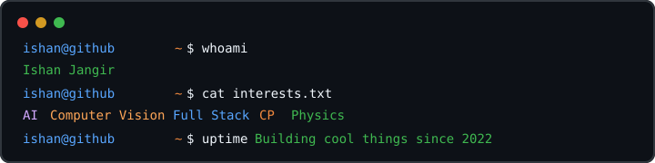
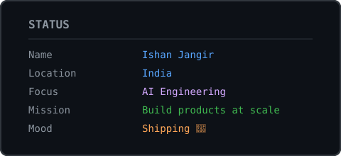
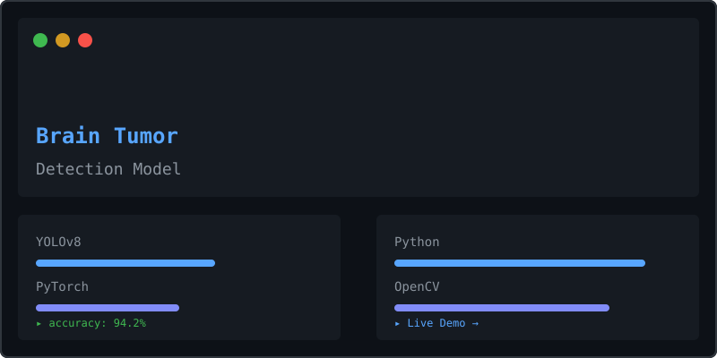
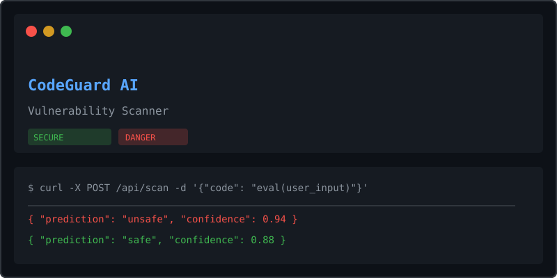
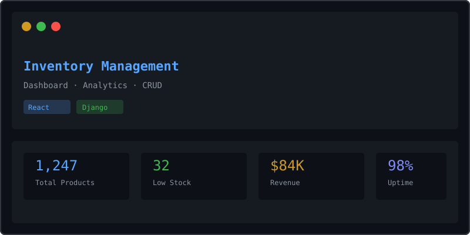
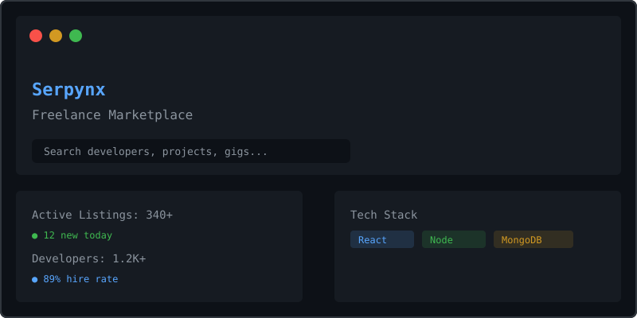

  

 

  

 

  

 

<h3 align="center">
  
</h3>

 

 

  <h2>📊 Live Dashboard</h2>
   
  <table>
    <tr>
      <td align="center"><b>Visitors</b></td>
      <td align="center"><b>Profile Views</b></td>
      <td align="center"><b>Followers</b></td>
      <td align="center"><b>Stars</b></td>
    </tr>
    <tr>
      <td align="center"></td>
      <td align="center"></td>
      <td align="center"></td>
      <td align="center"></td>
    </tr>
  </table>

 

 

  <h2>🚧 Currently Building</h2>
   
  <table>
    <tr>
      <td align="center" width="50%">
        
         
        <b>Kaggle Cell Tracking</b>
         
        <i>Computer Vision · PyTorch</i>
      </td>
      <td align="center" width="50%">
        
         
        <b>WEMINE</b>
         
        <i>Blockchain · Full Stack</i>
      </td>
    </tr>
    <tr>
      <td align="center">
        
         
        <b>Inventory Management</b>
         
        <i>React · Django</i>
      </td>
      <td align="center">
        
         
        <b>AI Code Review Tool</b>
         
        <i>LLMs · FastAPI</i>
      </td>
    </tr>
  </table>

 

 

  <h2>📈 Skill Progression</h2>
   
  <b>Python</b> 
  
    
  <b>React</b> 
  
    
  <b>Computer Vision</b> 
  
    
  <b>Backend</b> 
  
    
  <b>AI Research</b> 
  

 

 

  <h2>🏔️ GitHub Skyline</h2>
   
  
    
  
    
  
    
  
  

 

 

  <h2>🧠 AI Arsenal</h2>
   
  ✅ YOLOv8 &nbsp;·&nbsp; ✅ DistilBERT &nbsp;·&nbsp; ✅ GraphCodeBERT
    
  ✅ OpenCV &nbsp;·&nbsp; ✅ PyTorch &nbsp;·&nbsp; ✅ TensorFlow

 

 

  <h2>🛠️ Tech Stack</h2>
   
  &nbsp;&nbsp;
  &nbsp;&nbsp;
  &nbsp;&nbsp;
  &nbsp;&nbsp;
  &nbsp;&nbsp;
  &nbsp;&nbsp;
  
   
  &nbsp;&nbsp;
  &nbsp;&nbsp;
  &nbsp;&nbsp;
  &nbsp;&nbsp;
  &nbsp;&nbsp;
  &nbsp;&nbsp;
  

 

 

  <h2>🚀 Featured Projects</h2>
   
  <table>
    <tr>
      <td align="center" width="50%">
        
         
        <b>Brain Tumor Detection</b>
         
        <i>Computer Vision · YOLOv8 · PyTorch</i>
         
        
      </td>
      <td align="center" width="50%">
        
         
        <b><a href="https://github.com/Ishanssr/CodeGuard">CodeGuard AI</a></b>
         
        <i>AI · Django · Transformers</i>
         
        
      </td>
    </tr>
    <tr>
      <td align="center">
        
         
        <b>Inventory Management</b>
         
        <i>React · Django · PostgreSQL</i>
         
        
      </td>
      <td align="center">
        
         
        <b><a href="https://github.com/Ishanssr/Serpynx">Serpynx</a></b>
         
        <i>Full Stack · JavaScript · React</i>
         
        
      </td>
    </tr>
  </table>

 

 

  <h2>💻 Coding Setup</h2>
   
  💻 MacBook Pro M1 &nbsp;·&nbsp; 📝 VS Code + Neovim
    
  🐧 Arch Linux VM &nbsp;·&nbsp; 🐍 Python + JavaScript
    
  ☕ Coffee (fuel)

 

 

  <h2>📖 Project Timeline</h2>
   
  <b>2023</b> — Chess AI &nbsp;&nbsp;⬇️&nbsp;&nbsp;
  <b>2024</b> — Tumor Detection &nbsp;&nbsp;⬇️&nbsp;&nbsp;
  <b>2025</b> — Inventory &nbsp;&nbsp;⬇️&nbsp;&nbsp;
  <b>2026+</b> — <b>WEMINE</b>

 

 

  <h2>🎧 Currently Playing</h2>
   
  <i>🔊 Set up your <a href="https://github.com/kittinan/spotify-github-profile">Spotify Now Playing</a> card — I need your Spotify UID to activate this</i>

 

 

  <h2>⏱️ Coding Metrics</h2>
   
  <table>
    <tr><td align="left">Python</td><td align="right">18 hrs</td><td></td></tr>
    <tr><td align="left">TypeScript</td><td align="right">8 hrs</td><td></td></tr>
    <tr><td align="left">Markdown</td><td align="right">2 hrs</td><td></td></tr>
  </table>
   
  <i>Connect <a href="https://wakatime.com">WakaTime</a> for auto-updated metrics</i>

 

 

  <h2>🏆 Achievements</h2>
   
  

 

 

  <h2>🗣️ Ask Me About</h2>
   
  🧠 AI &nbsp;·&nbsp; 👁️ Computer Vision &nbsp;·&nbsp; ⚛️ React
    
  🐍 Django &nbsp;·&nbsp; 🏆 Kaggle &nbsp;·&nbsp; 🌌 Physics

 

 

  <h2>🌌 Current Obsession</h2>
   
  🧪 <b>General Relativity</b> — Spacetime curvature · Black holes · Gravitational waves
    
  ⚛️ <b>Quantum Computing</b> — Qubits · Superposition · Shor's algorithm
    
  🔭 <b>Cosmology</b> — Big Bang · Dark matter · Cosmic microwave background

 

 

  <h2>💬 Quote of the Day</h2>
   
  

 

 

  

 

<pre align="center" style="font-family: 'Courier New', monospace; background: #0d1117; padding: 12px; border-radius: 8px; border: 1px solid #30363d; color: #8b949e; line-height: 1.4;">
"The best way to predict the future is to invent it." — Alan Kay
</pre>

 

  ✨ Profile auto-updates daily
   
  ⭐ If you like what you see, give it a star!

