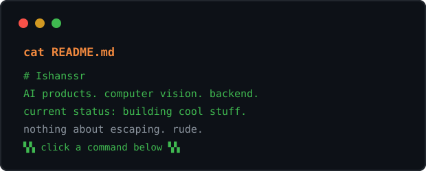

## 🖥️ ESCAPE_BASH — the profile game

<div align="center"></div>

## your move

```sh
cat README.md
```

| run |
|---|
| [`ls`](ls.md) |
| [`cd home/`](home.md) |

<div align="center"><sub>still stuck? <a href="../README.md">go back to the profile</a>.</sub></div>
