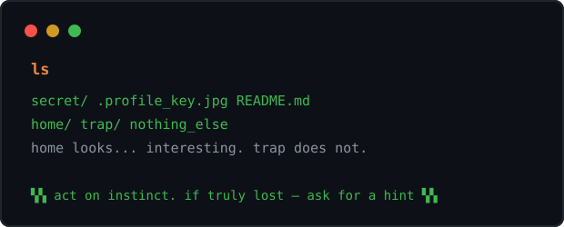

## 🖥️ ESCAPE_BASH — the profile game

## what do you do?

scrolling is your keyboard. click what you'd actually do:

| |
|---|
| [**open the folder named secret**](secret.md) |
| [**read the README**](cat_readme.md) |
| [**step into home**](home.md) |
| [**hunt for hidden files**](dot.md) |

🧭 lost? [ask for a hint →](hint-ls.md) — only you get to decide.

still stuck? <a href="../README.md">go back to the profile</a>.

